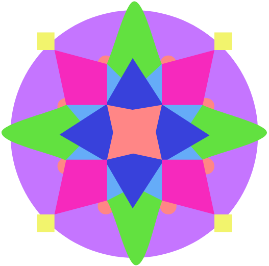

# Kaleidoscope

Document and Planning Document

2019-03-28, version 2.0

### DOCUMENT REVISION HISTORY

**Rev. 1.0 2019-02-26: Initial Version**

**Rev. 2.0 2019-03-28: Design Revamp**

###

###

###

###

###

###

###

###

###

###

###

### TABLE OF CONTENTS

[SYSTEM ARCHITECTURE](#system-architecture) 

[OVERVIEW MODEL](#overview-model) 

[MAIN APPLICATION MODEL (active MVC)](#main-application-model-active-mvc) 

[OVERLAY (Event-Based)](#overlay-event-based) 

[DESIGN DETAILS](#design-details) 

[CLASS DIAGRAM](#class-diagram) 

[STATE DIAGRAM](#state-diagram) 

[METHOD DESCRIPTIONS](#method-descriptions) 

[Background Process Class](#background-process-class) 

[Main App Class](#main-app-class) 

[Preset_Overlay Class](#preset_overlay-class) 

[Widget Class](#widget-class) 

[External Apps Class](#external-apps-class) 

[IMPLEMENTATION PLAN](#implementation-plan) 

[TESTING PLAN](#testing-plan) 

###

###

###

###

###

### SYSTEM ARCHITECTURE

Overall the Kaleidoscope Overlay will use an active Model-View-Controller architecture, as for the overlay itself, it will use an Event-Based architecture. We have two different interfaces for the user to interact with: the main application where the user customizes and changes configurations, and the actual overlay that the user would use, and both views interact with the model and user differently. We chose an active MVC for the main application because we wanted the controller to update the model which in turn, directly updates the view rather than the controller updating the both the view and the model like in an MVP architecture. As for the overlay, since each widget is it’s own reactive object, an event-based architecture is best used to depict this system. Although it isn’t as easy to follow the control flow in an event-based architecture as it would be in other architectures like pipe-and-filter, the event-based architecture is able to accurately represent how interaction with any widget would work while not going into so much detail of all the different specific tasks for the different specific widgets.

#### OVERVIEW MODEL

This is a high-level model of the Kaleidoscope program of how each component of our program interacts with each other. The program would have three main components: the main application, the overlay, and the background processes. The background process interacts with the main application to know when the user presses the key combination to open or close the overlay. The main application then loads the overlay with the user’s customization. The overlay and background process is continually sending signals to each other as the user interacts with the individual widgets of the overlay.

#### MAIN APPLICATION MODEL (active MVC)

**MODEL**

Contains data for the application and will directly manage the data and logic of the application. The model will act as a data container depending on the application. The model handles the data to a certain extent such as storing and restoring data (e.g. widgets saved to preset overlay or application settings) but does not make any decisions on what to do with the data.

**VIEW**

The view represents the user interface. The view has access to the model to retrieve data and cannot change the model. The view acts as an interface between the display and the rest of the program. The view pass information to the controller about user actions and updates once notified by the controller after the controller has updated the model.

**CONTROLLER**

The controller acts as an intermediate between the view and the model commanding them and passing data between them as needed.

#### OVERLAY (Event-Based)

The overlay opens and closes when the user presses the key combination. When the overlay appears, so do all the widgets that the user customized in the main application. As the user interacts with the widget such as pausing or skipping a song, the widgets are communicating with the background processes to update the widget state.

### DESIGN DETAILS

#### CLASS DIAGRAM

#### STATE DIAGRAM

**MAIN APPLICATION**

**OVERLAY**

### METHOD DESCRIPTIONS

#### Background Process Class

- 1. Function eventHandler()
        1. This listens for when the specific key combo is activated, either displaying the overlay or hiding the overlay
  2. Function initThread()
        1. Initializes a thread that controls a single widget.
  3. Function killThread()
        1. Deletes a widget thread
  4. Function getPreset()
        1. This would get an instance of the current preset class
  5. Function widgetListener(var args)
        1. Listens for input from the widgets and calls the sendDataToApp(info)
  6. Function appListener(var args)
        1. Listens for information from the external apps and calls the sendDataToWidget(info) function
  7. Function sendDataToWidget(var args)
        1. Sends the data from appListener to its respective widget
  8. Function sendDataToApp(var args)
        1. Sends the data from widgetListener to its respective external app.

#### Main App Class

- 1. Var curr_preset
        1. Stores which preset is currently selected
  2. Var id
        1. General id
  3. Var key_combo
        1. Stores the combo necessary to trigger the preset overlay
  4. Function displayPresetList()
        1. Displays the Preset List sidebar
  5. Function hidePresetList()
        1. Hides the Preset List sidebar
  6. Function setPreset()
        1. Sets the current Displayed Preset
  7. Function displayPreview()
        1. Displays the current selected Preset
  8. Function deletePreset()
        1. Deletes the selected instance of the Preset Class
  9. Function displayBackgroundSelection()
        1. Opens up the a popup containing the Background Screen UI
  10. Function changeBackGround()
        1. Takes selected background and displays within the preview window
  11. Function hideBackgroundUI()
        1. Hides the Background Screen UI
  12. Function displaySettings()
        1. Opens up a popup containing the Settiings UI
  13. Function displayPossibleWidgets()
        1. Opens up a popup containing the Widgets Screen UI

#### Preset_Overlay Class

- 1. Var Widget_list\[\]
        1. List of all the widgets that are within this preset
  2. Var resolution
        1. Stores the resolution that was selected within the settings ui
  3. Var grid_size
        1. Stores the grid size that was selected within the settings ui
  4. Var name
        1. Stores the name of this preset
  5. Function addWidget()
        1. Adds the selected widget from the widget selection UI to the widget_list array
        2. Sets the widgets size and location
  6. Function removeWidget()
        1. Deletes the selected widget from the widget_list
  7. Function savePreset()
        1. Saves the current Preset locally
  8. Function setName(name)
        1. Sets the name of the Preset
  9. Function duplicate()
        1. Makes a copy of the preset and switches the current preset to this copy

#### Widget Class

- 1. Var size_x
        1. Stores the widgets width
  2. Var size_y
        1. Stores the widgets height
  3. Var loc_x
        1. Stores the widgets x coordinate within the grid
  4. Var loc_y
        1. Stores the widgets y coordinate within the grid
  5. Var widget_id
        1. Stores the widget’s unique id (generated when created)
  6. Var opacity
        1. Stores the level of opacity from the Settings UI
  7. Function displayWidget()
        1. Toggles whether the Widget is displayed or not, accessed by the background processes
  8. Function eventHandler()
        1. Listens for when the widget is being used and passes data to the background processes
  9. Function backgroundListener()
        1. Listens for signals from the background process
  10. Function sendDataToBackground()
        1. Sends the widgets controller to the background process
  11. Function location(x,y)
        1. Sets the widgets loc_x and loc_y to x and y
  12. Function resize(x,y)
        1. Sets the widgets size_x and size_y to x and y

#### External Apps Class

- 1. Connects to the respective Widget’s app and communicates with it’s api

### IMPLEMENTATION PLAN

Our team plans to break into 3 sub-teams because our project involves 3 different software components: the main app, the overlay, and the background process. We will be developing these 3 software components concurrently. The first iteration will start each of these components, and subsequent iterations will involve integrating these 3 components.

**Sub-Team Overview**

- Main App
  - Teammates: Matt, Nina, and Chamath
  - UI design in Javascript, HTML, and CSS using the Electron framework
- Overlay
  - Teammate: Drew
  - UI design in Javascript, HTML, and CSS using the Electron framework
  - Leveraging proprietary or open-source APIs for widget design
- Background Process
  - Teammate: Devin
  - Thread management and communication with C

The following are user stories assigned to team members with time estimates. For our team, each team member will be assigned approximately 8 time units for an iteration. 1 time unit means a task should only take a couple of hours maximum, 3 means a task could take up to a week, etc. Unit tests will be developed concurrently with the features being implemented. So if a certain feature is being worked on, the unit test will also be worked on.

**Iteration Goals**

For the first iteration, the goal is to get the majority of the functionality of the three main software components prototyped. The three main software components are the Main App, the Overlay, and the Background Process. Unit tests will be developed as features are developed. Additionally, an initial CI/CD pipeline will be setup so regression testing can start in this phase with the unit tests. It is even possible that we will get to some integration testing.

In the second iteration, the main effort will be to finish the remaining functionalities required and to refine what already exists. The team will also make an effort to test the project more rigorously. System tests will be developed at this point, and potentially even orchestration tests.

Finally, in the third iteration, the project should already be close to done. Time will be spent cleaning up the code and making sure that the application is stable and ready to demo.

**Tasks**

**Main App**

| Task | Design main screen UI |
| --- | --- |
| Description | Mock up basic layout and styling for the main screen of the main app |
| Time Units | 3   |
| Assigned to | Matt, Nina |
| Iteration | 1   |
| Acceptance  Criteria | Able to load this page in the app and verify that key elements are there |

| Task | Design Settings UI |
| --- | --- |
| Description | Mock up basic layout and styling for the settings of the main app |
| Time Units | 3   |
| Assigned to | Chamath, Nina |
| Iteration | 1   |
| Acceptance Criteria | Able to load this page in the app and verify that key elements are there |

| Task | Design background screen UI |
| --- | --- |
| Description | Mock up basic layout and styling for the background of the main app |
| Time Units | 3   |
| Assigned to | Chamath, Nina |
| Iteration | 1   |
| Acceptance Criteria | Able to load this page in the app and verify that key elements are there |

| Task | Design widgets screen UI |
| --- | --- |
| Description | Mock up basic layout and styling for the widgets of the main app |
| Time Units | 3   |
| Assigned to | Matt, Nina |
| Iteration | 1   |
| Acceptance Criteria | Able to load this page in the app and verify that key elements are there |

| Task | Add widget |
| --- | --- |
| Description | Adding widget in main app adds it to overlay preview and causes it to appear when overlay is brought up |
| Time Units | 1   |
| Assigned to | Matt |
| Iteration | 1   |
| Acceptance Criteria | After adding widget in main app, verify that widget shows up properly in preview. Also, verify that this data is stored properly in the local file system |

| Task | Add hotkeys |
| --- | --- |
| Description | Configuring which key combo to bring up overlay with |
| Time Units | 1   |
| Assigned to | Chamath |
| Iteration | 1   |
| Acceptance Criteria | Hot key selection appears in main app screen. Hot key press results in the overlay being brought up |

| Task | Remove widget |
| --- | --- |
| Description | Removes widget from config preset and should not appear when that preset overlay is brought up |
| Time Units | 1   |
| Assigned to | Matt |
| Iteration | 1   |
| Acceptance Criteria | Widget does not appear in preset preview. The widget is also removed from the local file system |

| Task | Opacity |
| --- | --- |
| Description | Modifies the opacity of the widgets |
| Time Units | 1   |
| Assigned to | Matt |
| Iteration | 1   |
| Acceptance Criteria | Moving the opacity slightly affects the transparency of the widgets |

| Task | Grid |
| --- | --- |
| Description | Display a grid for configuring the location of widgets |
| Time Units | 1   |
| Assigned to | Nina |
| Iteration | 1   |
| Acceptance Criteria | When grid size is applied, a grid show appear on the preset preview |

| Task | Back button |
| --- | --- |
| Description | Takes user back to main app |
| Time Units | 1   |
| Assigned to | Chamath |
| Iteration | 1   |
| Acceptance Criteria | Pressing the back button brings the user back to the main screen of the main app |

| Task | Open presets list |
| --- | --- |
| Description | List of presets will appear on side of screen, with a new preset button, save preset button, and remove preset button |
| Time Units | 1   |
| Assigned to | Chamath |
| Iteration | 1   |
| Acceptance Criteria | Preset list is displayed when a tab is clicked. The preset list contains a list of presets that have been made |

| Task | Save preset overlay |
| --- | --- |
| Description | Preset overlay is saved |
| Time Units | 1   |
| Assigned to | Matt |
| Iteration | 1   |
| Acceptance Criteria | After save is clicked, the local file system contains the modified preset data |

| Task | Load preset overlay |
| --- | --- |
| Description | Populate preview |
| Time Units | 2   |
| Assigned to | Chamath |
| Iteration | 1   |
| Acceptance Criteria | Selecting a preset in the preset list causes the preset preview to be populated with the corresponding data |

| Task | Create new preset overlay |
| --- | --- |
| Description | A blank preset will display in the main app |
| Time Units | 1   |
| Assigned to | Matt |
| Iteration | 1   |
| Acceptance Criteria | Selecting create new preset overlay will cause the preview to show a blank template |

| Task | Switch to different opened preset overlay |
| --- | --- |
| Description | A different preset is selected for an app, making that the preset used when the overlay is brought up for that app |
| Time Units | 1   |
| Assigned to | Chamath |
| Iteration | 1   |
| Acceptance Criteria | Select a preset for an app and verify that when the app is launched, the correct overlay comes up on a hot key press |

| Task | Rename overlay |
| --- | --- |
| Description | Overlay is renamed, appearing in the preset list under the new name |
| Time Units | 1   |
| Assigned to | Chamath |
| Iteration | 1   |
| Acceptance Criteria | Renaming the preset and saving causes the preset to appear in the preset list under the correct name |

| Task | Remove preset overlay |
| --- | --- |
| Description | Preset will be deleted |
| Time Units | 1   |
| Assigned to | Matt |
| Iteration | 2   |
| Acceptance  Criteria | Deleting the preset overlay causes it to be removed from the local file system |

| Task | Duplicate preset overlay |
| --- | --- |
| Description | A preset is duplicated and ready to be modified |
| Time Units | 1   |
| Assigned to | Matt |
| Iteration | 2   |
| Acceptance  Criteria | Duplicating a preset causes an identical copy to be made and selected in the main app |

**Overlay**

| Task | Create basic widgets |
| --- | --- |
| Description | Widget size, other graphical effects |
| Time Units | 1   |
| Assigned to | Drew |
| Iteration | 1   |
| Acceptance  Criteria | Blank Electron windows are created and can be configured to different sizes and shapes |

| Task | Design Spotify widget |
| --- | --- |
| Description | How the Spotify widget looks |
| Time Units | 3   |
| Assigned to | Drew |
| Iteration | 1   |
| Acceptance  Criteria | Spotify widget design is complete |

| Task | Design Chrome widget |
| --- | --- |
| Description | How the Chrome widget looks |
| Time Units | 2   |
| Assigned to | Drew |
| Iteration | 2   |
| Acceptance  Criteria | Chrome widget design is complete |

| Task | Design YouTube widget |
| --- | --- |
| Description | How the Youtube widget looks |
| Time Units | 2   |
| Assigned to | Drew |
| Iteration | 2   |
| Acceptance  Criteria | Youtube widget design is complete |

| Task | Interact with widget |
| --- | --- |
| Description | Clicking widget allows user to interact with it |
| Time Units | 3   |
| Assigned to | Drew |
| Iteration | 2   |
| Acceptance  Criteria | User is able to interact with different widgets. This could involve clicking buttons that are responsive or entering text into input fields |

| Task | Design Notepad widget |
| --- | --- |
| Description | How the Notepad widget looks |
| Time Units | 3   |
| Assigned to | Drew |
| Iteration | 1   |
| Acceptance  Criteria | Notepad widget design is complete |

**Background Process**

| Task | Start background process |
| --- | --- |
| Description | When main app launched, or on startup, launch the background process |
| Time Units | 3   |
| Assigned to | Devin |
| Iteration | 1   |
| Acceptance  Criteria | Background process is started when main app is launched |

| Task | Hot key Listener |
| --- | --- |
| Description | Listen for when the specific key combo is pressed |
| Time Units | 1   |
| Assigned to | Devin, Chamath |
| Iteration | 1   |
| Acceptance  Criteria | A specific key combo is registered by an event listener |

| Task | Bring up overlay |
| --- | --- |
| Description | Key combo brings up a predefined overlay |
| Time Units | 1   |
| Assigned to | Devin |
| Iteration | 1   |
| Acceptance  Criteria | A specific key combo causes an overlay to be brought up |

| Task | Close overlay |
| --- | --- |
| Description | When the overlay is up, clicking the key combo again results in closing the overlay |
| Time Units | 1   |
| Assigned to | Devin |
| Iteration | 1   |
| Acceptance  Criteria | When the overlay is up, the key combo causes the overlay to disappear |

| Task | Place widget in screen |
| --- | --- |
| Description | Based on config settings, a widget thread is placed at a certain position in the display |
| Time Units | 2   |
| Assigned to | Devin |
| Iteration | 1   |
| Acceptance  Criteria | Based on a config file, when the overlay is brought up widgets are placed and sized properly |

| Task | Communicate with external app (Spotify) |
| --- | --- |
| Description | Data is received from and transferred to the app that the widget represents (e.g., Spotify) |
| Time Units | 2   |
| Assigned to | Devin |
| Iteration | 2   |
| Acceptance  Criteria | Validate that interaction with Spotify API has desired effect |

| Task | Communicate with external app (Chrome) |
| --- | --- |
| Description | Data is received from and transferred to the app that the widget represents |
| Time Units | 2   |
| Assigned to | Devin |
| Iteration | 2   |
| Acceptance  Criteria | Validate that interaction with Chrome API has desired effect |

| Task | Communicate with external app (Youtube) |
| --- | --- |
| Description | Data is received from and transferred to the app that the widget represents (e.g., Youtube) |
| Time Units | 2   |
| Assigned to | Devin |
| Iteration | 2   |
| Acceptance  Criteria | Validate that interaction with API Youtube has desired effect |

| Task | Manage main app instance |
| --- | --- |
| Description | Start and close an instance of the main app |
| Time Units | 1   |
| Assigned to | Devin |
| Iteration | 2   |
| Acceptance  Criteria | Background process is able to spin up and terminate connections to main app thread |

**CI/CD**

| Task | Setup CI/CD pipeline |
| --- | --- |
| Description | Setup a pipeline to run linting and unit tests on pushes and nightly regressions |
| Time Units | 2   |
| Assigned to | Matt |
| Iteration | 1   |
| Acceptance  Criteria | Nightly regression tests are run on a schedule executing pipeline tests containing unit and integration tests. A general pipeline is setup for branch commits and pushes |

| Task | Add integration and system tests to pipeline |
| --- | --- |
| Description | Add integration and system tests to pipeline |
| Time Units | 0.5 |
| Assigned to | Matt |
| Iteration | 2   |
| Acceptance  Criteria | Integration and system testing stages are added to pipeline |

| Task | Add orchestration stage to pipeline |
| --- | --- |
| Description | Add orchestration stage to pipeline |
| Time Units | 0.5 |
| Assigned to | Matt |
| Iteration | 2   |
| Acceptance  Criteria | Orchestration stage added to pipeline |

### RISK PLAN

The risks involved in our project stem from the background process of our program. The main risk is due to the background process being coded in C, since C allows for direct communication with the OS, it might be dangerous when the background process communicates with some of the external widgets. If one of the widgets has malicious intents, there is a chance that it may be able to gain access to the system’s OS and wreak havoc within the computer. Our way of avoiding this issue is to limit what data/information can be passed from the external widgets to our background process. Each widget’s data will be parsed using Javascript before getting sent to our background process (written in C).

### LIMITATIONS

The main limitation for our program will be the number of supported widgets, our program relies on already existing widget API’s so this limits what widgets can be supported by our program. Other major limitations of our program include only being able to run on Windows OS, to make our program run on other OS the background process will need to be redone for each OS. Since our program is geared towards Gamers we decided to stick with Windows as the OS we focus on. Another minor limitation is for each widget that has an existing API, we will need to create a corresponding Javascript file to correctly parse the data.

### TESTING PLAN

We plan to host our project on Gitlab so that we can leverage Gitlab’s continuous integration tools. These include CI/CD pipelines, which we can setup to test our code. The CI/CD pipeline will be configured with a Docker container, which is an image containing everything the code will need to run. This container will contain our code in addition to Nodejs modules and any other dependencies. We will setup the pipeline to run a code lint, i.e., check for formatting, in addition to running unit testing stages. Because our project involves orchestrating different software components, we may have an orchestration stage at the end to ensure that everything works together. The pipeline will run on commits to branches and it can be setup to run a nightly regression.

Framework:

We will be using Cucumber, a software tool used for testing software. Cucumber runs automated acceptance tests, following the Behavior Driven Development style. Cucumber supports a variety of different programming languages including JavaScript in which we will be coding for the front-end of our project. Cucumber will be used for system and orchestration tests because it supports UI automation.

Cucumber: <https://cucumber.io/>

We will also use Mocha, which contains some helpful functions to verify our test results. Mocha will mainly be used for unit and integration testing.

Mocha: <https://mochajs.org/>

**Unit Testing**

We will be unit testing for validating the behavior of functions, methods, and objects. We will develop units as we develop features. Unit tests will be split between the three major software components, i.e., the Main App, the Overlay, and the Background Process.

Libraries:

We will be using Chai, a JavaScript assertion library running on Node.js that allows us to run tests. We are going to use Node.js which is a cross-platform JavaScript run-time environment.

Chai: <https://www.chaijs.com/>

**Integration Testing**

Integration testing will be performed on groups of modules. These will be modules that are likely to interact with each other, or provide logical workflows. For example, a series of method calls may be called on an object verifying that certain properties are updated. These tests will also focus on high level modules that orchestrated various sub-modules. The tests will be detailed in Mocha and assertions will be handled with Chai. As with the unit tests, these tests will be split by the three major software components.

**System Testing**

Our application will be tested by Spectron, an open source framework for writing integrations tests. Spectron allows our application to be test-driven remotely with full support for the Electron APIs. Spectron is built on top of ChromeDriver and WebDriverIO which allows us to run UI automated tests. Cucumber will be used to defined the tests in a behavior driven manner. These tests will also be split by software component.

Spectron: <https://electronjs.org/spectron>

**Orchestration Testing**

This is the final stage of testing, and will be implemented last. In these tests, all three major software components will be tested together as one system. It will be similar to the system tests, involving UI automation. The tests will be defined and implemented with Cucumber and Spectron.

**Regression Testing**

Regression testing will be performed on a nightly basis. Because we are using Gitlab to host our code, we can configure CI/CD pipelines that run on a schedule. The regression testing will run a code lint, unit tests, integration tests, system tests, and orchestration tests sequentially.
